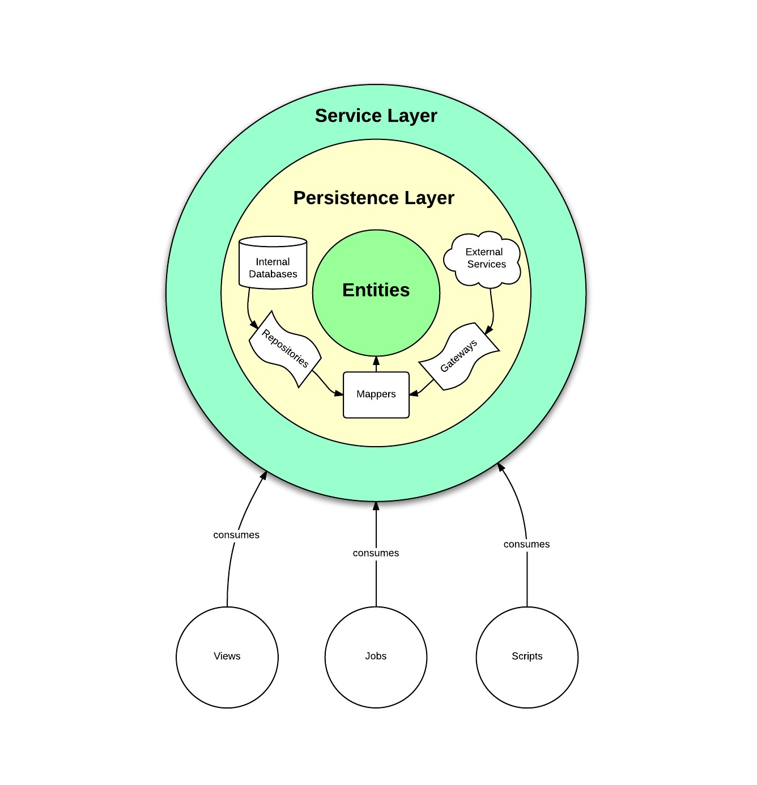
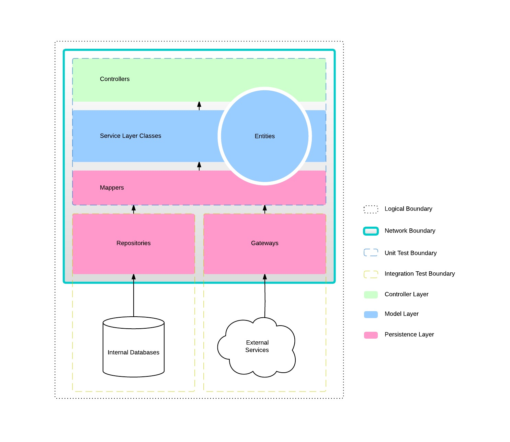

# MVCS

Introduction
============

MVCS is an application development approach that adds an additional layer to
MVC -- the **Service Layer**. In the same way that MVC takes the position that
you should separate model logic from view and controller logic, MVCS takes this
notion a step further by advocating for application logic to live in the
Service Layer, internally binding persistence to **Entities** for
loose-coupling.

The main benefits of this approach are:

-   **Persistence-agnosticism**. The Persistence Layer can evolve and even be
    replaced without refactoring business logic.
-   **Controller-agnosticism**. The Service Layer can be exposed in
    multiple controllers. For example, the same "users" Service Layer can be
    used in multiple views, API versions, Thrift handlers, scripts, CLI
    programs, Kafka Ingesters, etc. without needing to duplicate code.
-   **Framework-agnosticism**. The Service Layer is developed "away" from the
    framework being used (e.g., Flask), so upgrading or replacing it
    is trivial.
-   **Predictable development and testing patterns**. Creates a common language
    for developing and testing different responsibilities. Abstracting
    persistence allows for test fixtures that don't need to interact with
    a database.
-   **Collaborative language**. Moves the conversation away from how to develop
    and test commonly recurring functionality, to how to organize
    responsibilities and how different layers of an application
    should interact.

The Service Onion
=================

MVCS works by dividing a domain into a common set of layers, often called the
"Service Onion":

  
  | Layer | Responsibility |
  | --- | --- | 
  | Entities | Often referred to as "Domain Models", these classes represent business "things" - for example, a User in the Users Service. These objects are the language of the application. Their responsibility is to be a container (often called an Envelope) for the business object, to represent relationships to other business objects, to contain business logic related to these objects, and to optionally do validation & serialization of themselves. Entities are hydrated by the Service Layer by mapping raw data from Gateways & Repositories to them with Mappers. |
  | Service Layer Classes | These classes contain all the things your application can do, that is to say they contain all of your application's Application Logic. They are a way to "expose" your application to the Controller Layer and to other Service Layer Classes. They speak in Entities by hydrating them with raw data from Gateways & Repositories using Mappers. The Service Layer is the outer most layer of the Service Onion - you can imagine peeling back the layers, revealing the persistence internals. The Service Layer never leaks persistence details. In order to avoid overloading the term Services, which has come to mean API's in a distributed system, its better to use the term "Service Layer Class" or "Service Layer" when referring to this layer. |
  | Repositories | Contain queries to internal databases and returns raw data. This data is typically mapped to Entities by the Service Layer using Mappers. When using an ORM, Repositories tend to query against Data Store classes, whose only responsibility are to represent various tables and relationships between them. For each query needed in an application, there should be a correlating method on a Repository which executes the query and returns the raw data. |
| Gateways | Sister-layer to Repositories - Gateways contains queries to external services (instead of internal databases) and return raw data. This data is typically mapped to Entities by the Service Layer using Mappers. Gateways tend to query against client libraries (like generated Thrift, for example) or network libraries. If needed, connection details may be represented in a Connection class, for example when configuring an instantiating an API client.
| Mappers | Responsible for mapping persistence to and from Entities. |
 

It's important to note that the inner-most layers of the Service Onion **must
not** know about layers that live above them. For example, Entities do not know
about their own persistence or the Service Layer or view or jobs in the
Controller Layer. This is the same for each layer in the Service Onion and is
where most of the MVCS's decoupling benefits come from.

Directory Structure
===================

On the filesystem, these layers tend to be named after their problem domain and
then organized by responsibility.

    #
    # Entities
    #
    foo/entities/user.py    # contains User entities
    foo/entities/comment.py # contains Comment entities

    #
    # Service Layer Classes
    #
    foo/services/user.py    # contains UserService
    foo/services/comment.py # contains CommentService

    #
    # Repositories
    #
    foo/services/repositories/user.py    # contains UserRepository
    foo/services/repositories/comment.py # contains CommentRepository

    #
    # Gateways
    #
    foo/services/gateways/comment.py  # contains CommentGateway

    #
    # Mappers
    #
    foo/services/mappers/user.py    # contains UserMapper
    foo/services/mappers/comment.py # contains CommentMapper

Note that all persistence layer classes are stored as modules in the services
directory. This is because persistence details should be hidden by the Service
Layer.

Testing
=======

MVCS not only gives you a vocabulary and method for organizing commonly
recurring functionality - it also offers predictable testing patterns. The
following diagram indicates how you should think about testing each layer.
Notice how integration tests are pushed to the deepest layers of our
application - this ensures our test suite is always fast, but also that our
assumptions on internal databases and external services are correct.

  -----------------------------------------------------------------------------
  Layer         How to test
  ------------- ---------------------------------------------------------------
  Entities      Unit tests

  Service Layer Unit tests; Mock the persistence layer
  Classes

  Repositories  Integration tests; Use fixtures to set up the state of the
                world

  Gateways      Integration tests; Use a [vcr] to record and replay the state
                of the world

  Mappers       Unit tests

  Controllers   Unit tests; Mock the service layer; Optional and very selective
                end-to-end-tests
  -----------------------------------------------------------------------------

  [vcr]: https://github.com/kevin1024/vcrpy

> NOTE: Your Service Layer Classes should never use objects that "you don't
> own" - for example, if a Service Layer Class uses an ORM's library directly
> (like SQLAlchemy's session) then you have no choice but to write integration
> tests since [you should *NEVER* mock code that you don't own].

  [you should *NEVER* mock code that you don't own]: http://blog.8thlight.com/eric-smith/2011/10/27/thats-not-yours.html

History / Related Reading
=========================

Employing Service Layers in application development stems from the marriage of
DDD (dividing a problem area by its pieces and developing a common language to
refer to those pieces) & SOLID/GRASP (dividing a technical problem into loosely
coupled, composable, extensible, testable, and finite objects with OO). It is
often seen in languages like Java (especially in Spring), ASP.NET, & PHP
(especially in Symfony). The benefits are not language specific, and can be
deployed in most settings.

Check out the following readings for more insight:

-   [Domain-Driven Design: Tackling Complexity in the Heart of
    Software](http://www.amazon.com/Domain-Driven-Design-Tackling-Complexity-Software/dp/0321125215)
-   [Martin Fowler - Service
    Layer](http://martinfowler.com/eaaCatalog/serviceLayer.html)
-   [Martin Fowler - Domain
    Model](http://martinfowler.com/eaaCatalog/domainModel.html)
-   [Martin Fowler - Data
    Mapper](http://martinfowler.com/eaaCatalog/dataMapper.html)
-   [Martin Fowler -
    Repository](http://martinfowler.com/eaaCatalog/repository.html)
-   [Martin Fowler -
    Gateway](http://martinfowler.com/eaaCatalog/gateway.html)
-   [Martin Fowler -
    AnemicDomainModel](http://www.martinfowler.com/bliki/AnemicDomainModel.html)
-   [Martin Fowler -
    SemanticDiffusion](http://martinfowler.com/bliki/SemanticDiffusion.html)
-   [Martin Fowler - Testing Strategies in a Microservice
    Architecture](http://martinfowler.com/articles/microservice-testing/)
-   [Writing Robust PHP Backends with Zend
    Framework](https://web.archive.org/web/20111007004411/http://www.angryobjects.com/2009/03/30/writing-robust-php-backends-with-zend-framework/)
-   [Play-Doh: Modelling your
    Objects](http://www.slideshare.net/weierophinney/playdoh-modelling-your-objects)
-   [Stefan Priebsch - Why MVC is not an application
    architecture](http://vimeo.com/40968850)
-   [Action-Domain-Responder: a web-specific refinement of
    Model-View-Controller](https://github.com/pmjones/adr)
-   [Jeffrey Palermo - The Onion
    Architecture](http://jeffreypalermo.com/blog/the-onion-architecture-part-1/)
-   [Robert Martin - The Clean
    Architecture](http://blog.8thlight.com/uncle-bob/2012/08/13/the-clean-architecture.html)
-   [Jon Leighton - Explaining Focused Controller in
    Rails](http://www.jonathanleighton.com/articles/2012/explaining-focused-controller/)
-   [Spring Framework - Application
    Layering](http://docs.spring.io/spring-roo/reference/html/base-layers.html)
-   [Dave Elkan - A Layred Node.js Architecture using
    Express](http://www.edave.net/2011/03/22/a-layered-node-js-architecture-using-express/)
-   [Salesforce Stack Exchange - How to best structure code so it can be
    run synchronously and in
    Batch](http://salesforce.stackexchange.com/questions/11208/how-to-best-structure-code-so-it-can-be-run-synchronously-and-in-batch)
-   [Stack Overflow - Service Layer validation vs. Domain Object
    validation](http://stackoverflow.com/questions/5108210/service-layer-validation-vs-domain-object-validation-potential-abuse-of-doma)
-   [Stack Overflow - Heavy Model Classes or Lightweight Service
    Layer](http://stackoverflow.com/questions/5850249/zf-doctrine-2-heavy-model-classes-or-lightweight-model-service-layer)
-   [Using Services to Keep Your Rails Controllers Clean and
    DRY](https://blog.engineyard.com/2014/keeping-your-rails-controllers-dry-with-services)
-   [Python SOLID](http://www.slideshare.net/DrTrucho/python-solid)
-   [Foundations of OOP Introduction to SOLID
    principles](https://www.youtube.com/watch?v=_eWWONHXc9c)
-   [Foundations of OOP Introduction to GRASP
    principles](https://www.youtube.com/watch?v=hqYy6Yfa-Lg)

FAQ
===

How should I name service/view/repo/gateway methods?
----------------------------------------------------

Here's a format you could use:

-   views: HTTP verbs (`get`, `put`, `post`, `delete`)
-   repos/gateways: filesystem-like verbs (`read`, `write_new`, `write_update`,
    `drop`)
-   service layer classes: (`fetch`, `create`, `update`, `remove`)

Otherwise you might get confused as you end up with very similar method names
across responsibilities.
